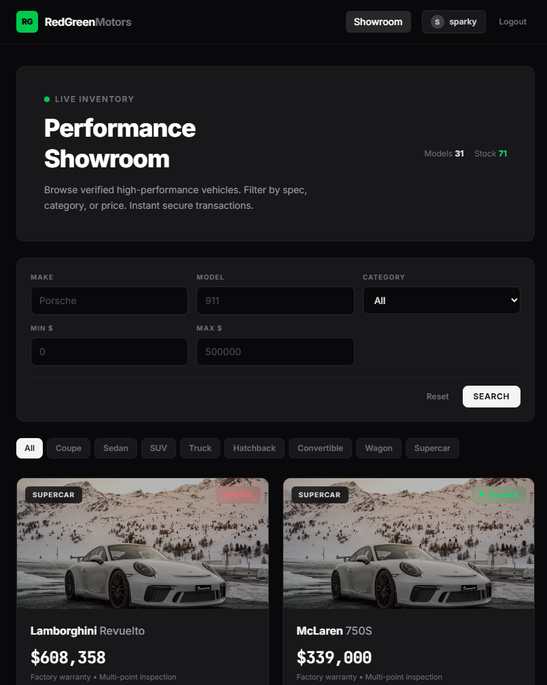

<p align="center">
  
</p>

<h1 align="center">RedGreenMotors</h1>

<p align="center">
  <strong>A full-stack digital vehicle dealership with real-time inventory, instant purchases, and admin management — built with Express, React, and Prisma.</strong>
</p>

<p align="center">
  
  
  
  
  
</p>

---

## About

RedGreenMotors is a full-stack performance vehicle dealership platform that lets users browse a curated showroom of 30+ high-performance vehicles, filter by category/make/price, and instantly purchase cars — all backed by a secure RESTful API with JWT authentication and role-based access control. Admins can manage inventory in real time: add new vehicles, edit specs, restock allocations, or decommission models — all from the same UI.

The project was designed to demonstrate a clean, production-grade architecture with test-driven development (TDD), layered separation of concerns (routes → controllers → services → repositories), and a modern frontend with smooth animations and a flat dark UI aesthetic. Whether you're evaluating full-stack patterns, learning Prisma with SQLite, or just want a good-looking starter template — this project covers it.

---

## Demo

<p align="center">
  
</p>

> The showroom features staggered card entrance animations, shimmer loading skeletons, live stock pulse indicators, smooth hover lifts with image zoom, scale-in modals, and slide-in toast notifications — all with zero gradients, pure flat design.

---

## Key Features

- **🔐 JWT Authentication** — Secure registration & login with bcrypt password hashing and Bearer token sessions persisted in localStorage
- **👤 Role-Based Access** — `USER` and `ADMIN` roles with middleware-enforced route protection
- **🚗 Vehicle CRUD** — Full Create / Read / Update / Delete for inventory (admin-only writes)
- **🔍 Multi-Parameter Search** — Filter by make, model, category, min/max price with real-time results
- **🛒 Instant Purchase** — Atomic stock decrement with `409 Conflict` when out-of-stock
- **📦 Admin Restock** — One-click +3 restock and editable quantity fields
- **🎯 Category Quick-Filters** — Pill buttons for Coupe, Sedan, SUV, Truck, Hatchback, Convertible, Wagon, Supercar
- **✨ Smooth Animations** — Staggered fade-up cards, shimmer skeletons, scale-in modals, slide-in toasts, pulse-ring stock indicators
- **🌑 Flat Dark UI** — Clean zinc-950 dark theme with zero gradients, Inter + JetBrains Mono typography
- **🧪 Full Test Suite** — 13 integration tests across auth, health, and vehicle endpoints using Jest + Supertest
- **🌱 Database Seeding** — One command populates 30+ luxury/performance vehicles and default user accounts

---

## Tech Stack

| Layer | Technology |
|-------|-----------|
| **Frontend** | React 19, TypeScript, Vite 8, Tailwind CSS 4, React Router 7 |
| **Backend** | Node.js, Express 4, TypeScript 5 |
| **Database** | SQLite via Prisma ORM 5 |
| **Auth** | bcrypt, jsonwebtoken (JWT) |
| **Testing** | Jest 29, Supertest 6, ts-jest |
| **Dev Tools** | Nodemon, ts-node, PostCSS |

---

## Prerequisites

| Requirement | Version |
|-------------|---------|
| **Node.js** | >= 18.x |
| **npm** | >= 9.x |
| **Git** | Any recent version |

No external databases required — SQLite runs as a local file (`prisma/dev.db`).

---

## Installation

```bash
# 1. Clone the repository
git clone https://github.com/your-username/RedGreenMotors.git
cd RedGreenMotors

# 2. Install backend dependencies
cd backend
npm install

# 3. Set up the database
npx prisma migrate dev --name init
npx prisma generate

# 4. Seed the database with 30+ sample vehicles & default accounts
npm run seed

# 5. Install frontend dependencies
cd ../frontend
npm install
```

---

## Usage / Quick Start

You'll need **two terminal windows** — one for the backend, one for the frontend.

### Terminal 1 — Backend API (port 3000)

```bash
cd backend
npm run dev
```

### Terminal 2 — Frontend Dev Server (port 5173)

```bash
cd frontend
npm run dev
```

Then open **http://localhost:5173** in your browser.

### Default Accounts

| Role | Email | Password |
|------|-------|----------|
| **Admin** | `admin@redgreenmotors.com` | `admin123` |
| **User** | `client@redgreenmotors.com` | `user123` |

> Admin accounts can create, edit, restock, and delete vehicles. Standard users can browse and purchase.

### Run Tests

```bash
cd backend
npm test
```

```
PASS tests/vehicles.test.ts
PASS tests/auth.test.ts
PASS tests/integration/health.test.ts

Test Suites: 3 passed, 3 total
Tests:       13 passed, 13 total
```

### API Endpoints

| Method | Endpoint | Auth | Description |
|--------|----------|------|-------------|
| `GET` | `/api/health` | — | Health check |
| `POST` | `/api/auth/register` | — | Register new user |
| `POST` | `/api/auth/login` | — | Login, returns JWT |
| `GET` | `/api/vehicles` | Bearer | List all vehicles |
| `GET` | `/api/vehicles/search` | Bearer | Filter by make/model/category/price |
| `POST` | `/api/vehicles` | Admin | Create vehicle |
| `PUT` | `/api/vehicles/:id` | Admin | Update vehicle |
| `DELETE` | `/api/vehicles/:id` | Admin | Delete vehicle |
| `POST` | `/api/vehicles/:id/purchase` | Bearer | Purchase (decrements stock) |
| `POST` | `/api/vehicles/:id/restock` | Admin | Restock (increments stock) |

---

## Project Structure

```
RedGreenMotors/
├── backend/
│   ├── prisma/
│   │   ├── schema.prisma          # User & Vehicle models
│   │   └── seed.ts                # 30+ sample vehicles & accounts
│   ├── src/
│   │   ├── controllers/           # Request handlers
│   │   ├── middleware/             # Auth & error middleware
│   │   ├── repositories/          # Prisma database queries
│   │   ├── routes/                # Express route definitions
│   │   ├── services/              # Business logic layer
│   │   ├── app.ts                 # Express app configuration
│   │   └── server.ts              # Server entry point
│   └── tests/                     # Jest + Supertest integration tests
├── frontend/
│   ├── src/
│   │   ├── api/                   # Typed fetch wrappers
│   │   ├── components/            # Navbar, VehicleCard, SearchFilterBar, etc.
│   │   ├── context/               # AuthContext with localStorage persistence
│   │   └── pages/                 # Dashboard, Login, Register
│   └── index.html
└── docs/
    └── images/                    # README assets
```

---

## License

This project is open source and available under the [MIT License](LICENSE).
