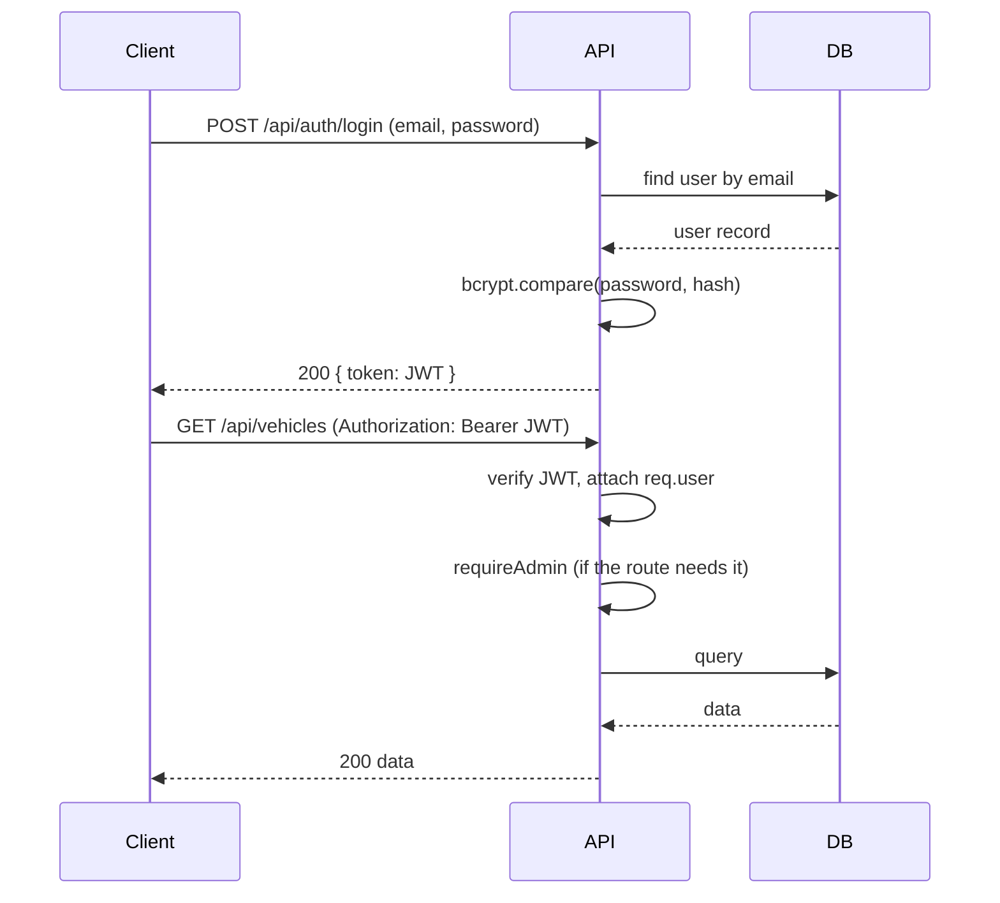

# Architecture
## Car Dealership Inventory System

## 1. Stack
| Layer | Choice | Why |
|---|---|---|
| Backend | Node.js + TypeScript + Express | Same language as the mandated React frontend; deepest AI-tool training data of the three kata-allowed options; pairs cleanly with Prisma for end-to-end typed models |
| ORM / DB | Prisma + SQLite (dev) → PostgreSQL (deploy) | SQLite is zero-setup for local dev; swapping the Prisma datasource to Postgres for deployment is a config change, not a rewrite |
| Auth | JWT (`jsonwebtoken`) + `bcrypt` | Standard, well-documented, exactly what the kata specifies |
| Frontend | React + Vite + TypeScript + Tailwind | Mandated stack; Vite keeps the dev loop fast |
| Backend tests | Jest + Supertest | Integration-tests the HTTP layer directly — this is what "Red-Green-Refactor... especially for backend logic" is really asking for |
| Frontend tests | Vitest + React Testing Library | Standard pairing with Vite/React |

*If you know Python or Ruby better than this stack, the same architecture maps cleanly onto FastAPI+SQLAlchemy+Pytest or Rails+RSpec — see the note at the end of `implementation_plan.md`.*

## 2. Repo Layout
```
car-dealership-inventory/
├── README.md
├── PROMPTS.md
├── design.md
├── Product_Requirements.md
├── architecture.md
├── implementation_plan.md
├── backend/
│   ├── src/
│   │   ├── routes/          # thin route definitions
│   │   ├── controllers/     # req/res handling only
│   │   ├── services/        # business logic (stock checks, role checks)
│   │   ├── repositories/    # Prisma queries, isolated from services
│   │   ├── middleware/      # auth, requireAdmin, error handler
│   │   └── server.ts
│   ├── prisma/schema.prisma
│   └── tests/
│       ├── unit/
│       └── integration/
└── frontend/
    ├── src/
    │   ├── components/
    │   ├── pages/
    │   ├── context/AuthContext.tsx
    │   ├── api/              # fetch wrappers, one per resource
    │   └── App.tsx
    └── tests/
```

The routes → controllers → services → repositories split is what makes the SOLID requirement concrete: each layer has one job, and it's the boundary AI tools tend to blur if you let them write a whole feature in a single file.

## 3. Data Model
```prisma
model User {
  id           String   @id @default(uuid())
  name         String
  email        String   @unique
  passwordHash String
  role         Role     @default(USER)
  createdAt    DateTime @default(now())
}

enum Role {
  USER
  ADMIN
}

model Vehicle {
  id        String   @id @default(uuid())
  make      String
  model     String
  category  String
  price     Float
  quantity  Int      @default(0)
  createdAt DateTime @default(now())
  updatedAt DateTime @updatedAt
}
```

## 4. API Contract
| Method | Endpoint | Auth | Notes |
|---|---|---|---|
| POST | /api/auth/register | Public | 201 + user (no password); 409 on duplicate email |
| POST | /api/auth/login | Public | 200 + JWT; 401 on bad credentials |
| GET | /api/vehicles | User | Returns all vehicles, including quantity 0 |
| GET | /api/vehicles/search | User | Query params: `make, model, category, minPrice, maxPrice` |
| POST | /api/vehicles | Admin | 201 + created vehicle |
| PUT | /api/vehicles/:id | Admin | 200 + updated vehicle; 404 if missing |
| DELETE | /api/vehicles/:id | Admin | 204; 404 if missing |
| POST | /api/vehicles/:id/purchase | User | Decrements qty by 1; 409 if qty is 0 |
| POST | /api/vehicles/:id/restock | Admin | Increments qty by request body amount |

## 5. Auth Flow


## 6. Cross-Cutting Concerns
- **Validation:** reject malformed bodies before they hit a service (e.g., with `zod` or `express-validator`).
- **Error handling:** one central error-handling middleware, a consistent JSON error shape (`{ error: string }`).
- **Never trust the client:** the frontend disables the Purchase button at qty 0 for UX, but the backend must independently reject purchases against a zero-quantity vehicle — the disabled button is not the security boundary.

## 7. Testing Strategy
- Integration tests (Supertest) hitting real routes against a test SQLite database, one file per resource (`auth.test.ts`, `vehicles.test.ts`).
- Unit tests for pure logic that doesn't need the DB (e.g., a `canPurchase(quantity)` helper).
- Target: every endpoint gets at least a happy-path test and its main failure-path test (bad auth, not-found, out-of-stock, non-admin).

## 8. Deployment (optional)
- Backend + Postgres: Render, Railway, or Fly.io — all have a free tier and support env-var-based Prisma connection strings.
- Frontend: Vercel or Netlify, pointed at the deployed API URL via an env var.
